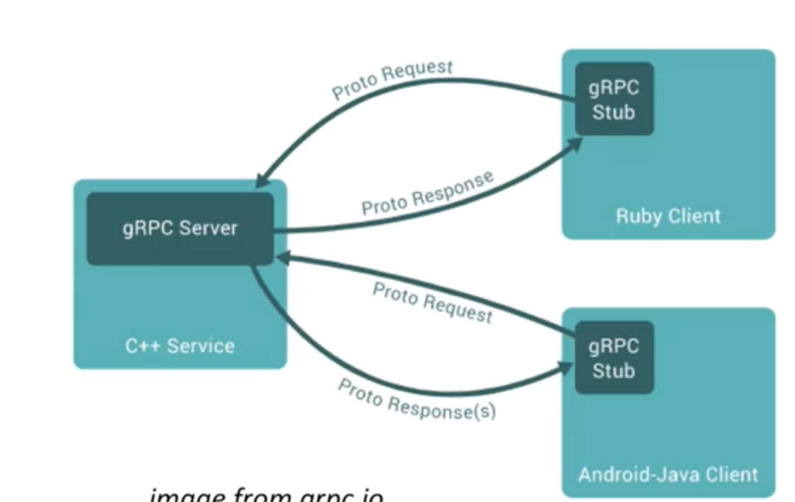
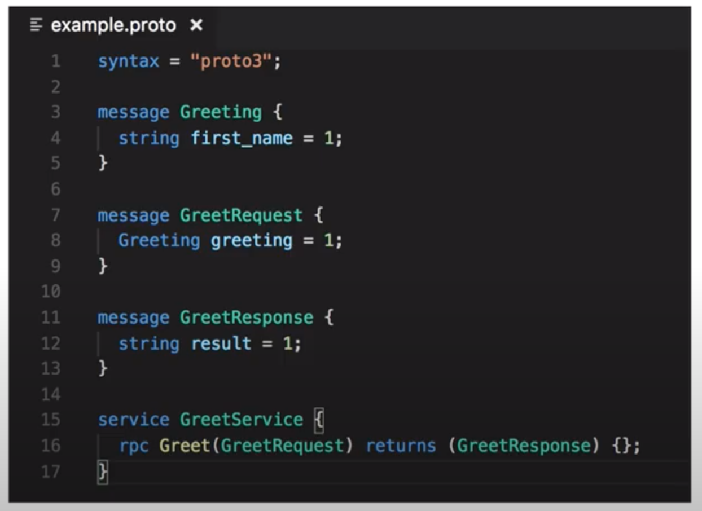
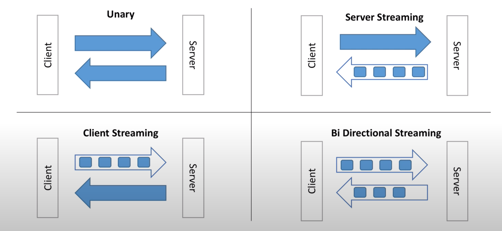
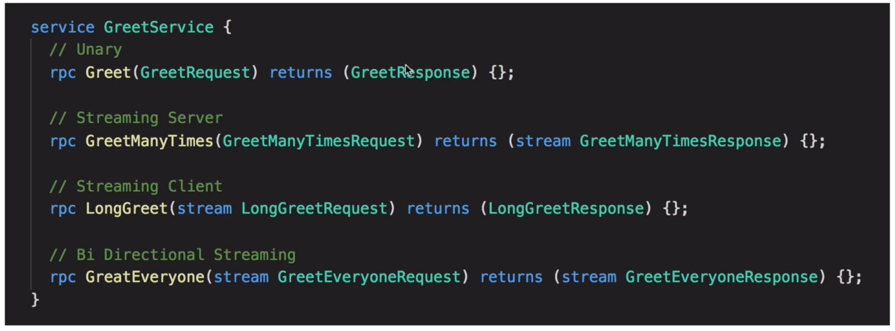

# Application design
- These days applications are build using micro services
- Each micro services can be build in different lanugages
- These micro services needs to agree on API to exchange data
- One of the popular is REST to communicate between micro services
# Building REST API is hard
- Need to think on data model
    - JSON
    - XML
    - Binary 
- Need to think about endpoint
    - GET /api/v1/user/123/post/456
    - POST /api/v1/user/123/post
- How to invoke and handle errors
- Need to think about efficiency in terms of how much data needs to read in calling api
- How about load balancing?
- Authentication
- Monitoring
- Logging
GRPC solves these complexities

# What is an API?
- At its core, an API is contract, saying
    - Send me this request (client)
    - I will send you this response(server)
- It's all about data
- Rest is leave to gRPC framework
# What is gRPC?
- gRPC is a free and open source framework developed by Google
- gRPC is part of CNCF
- It allow to define request/response for RPC and handles all the rest for you
- It is build on top of HTTP/2, low latency, support streaming, language independent
- makes it easy to plug in authentication, load balancing, logging and monitoring
# What is RPC?
- An RPC is a remote procedure call
- In your client code, it looks like you are calling a function directly on server

# How to get started?
- At the core of gRPC,  you need to define messages and services in Protocol Buffers
- The rest of the gRPC code will be generated for you and you will have to provide implementation for it
- One .proto file works for 12 languages 

# Why protocol buffers?
- Protocol buffers are language agnostic
- Code can be generated for pretty much any languages
- Data is binary and efficiently serialize 
# 4 types of API in gRPC

# gRPC Reflection and CLI
Reflection is used for following
- Having servers to expose which endpoints are available
- Allow CLI to talk to server without a preliminary .proto file
# Reference
https://www.youtube.com/watch?v=XRXTsQwyZSU
